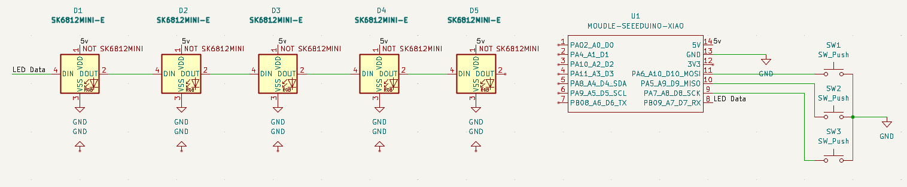
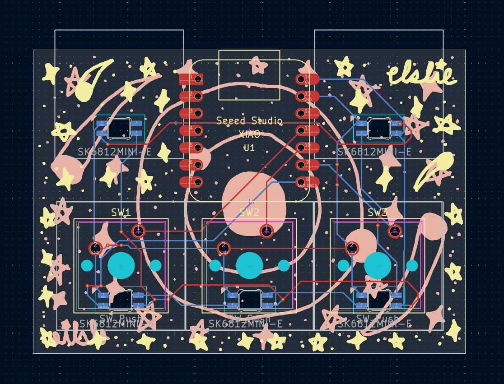
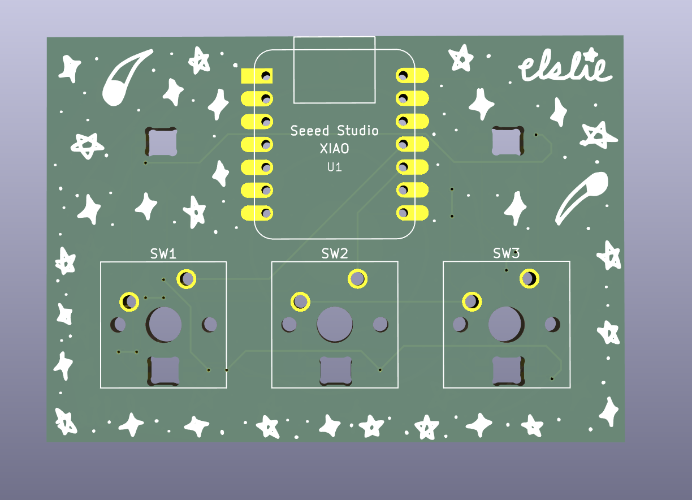
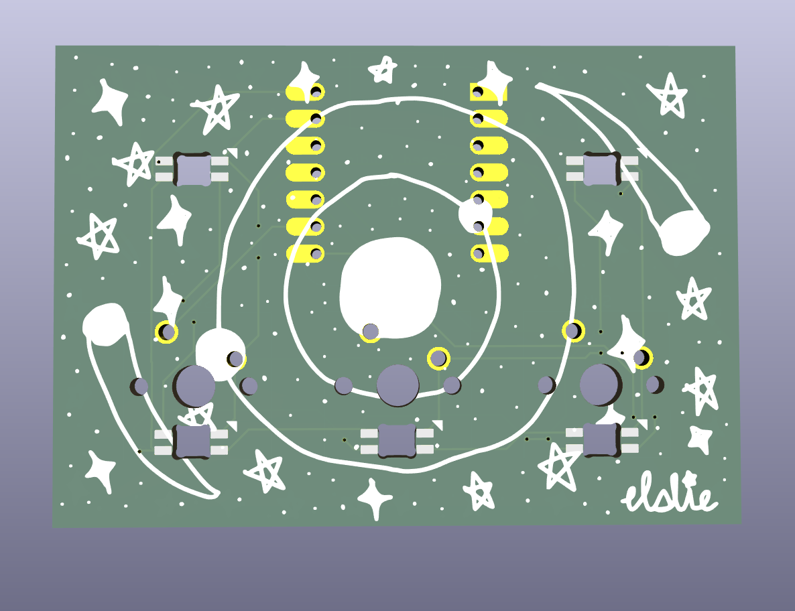
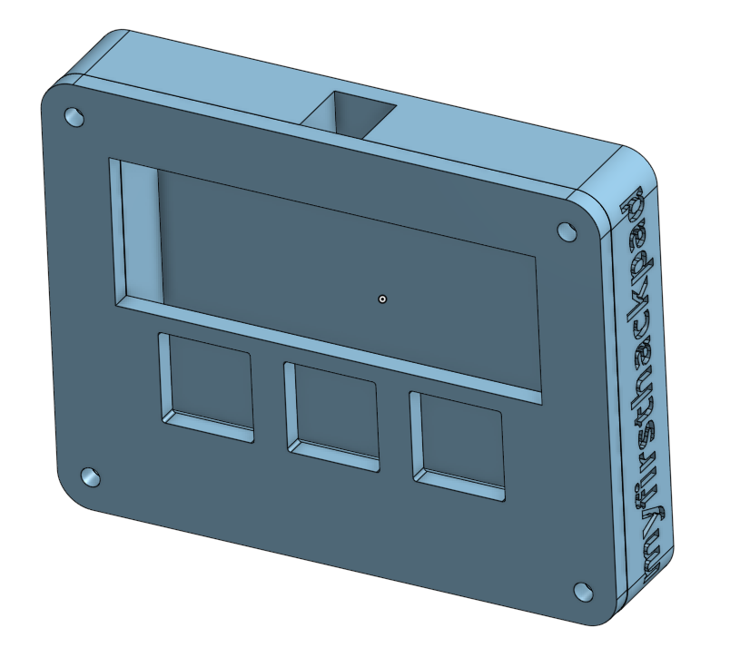

# June 8th: Building schematic, pcb, and case - 7hrs

I was able to make the schematic, PCB, and the case.

For the schematic, I used the example schematic from the hackpad guide, but later I decided I wanted to add neopixels, so I added them in later.

The right portion of the schematic is the microcontroller and the 3 keys, and the left portion is the 5 neopixels.

For the PCB, it was a bit of a struggle wiring because I was using a different layout and deviated from the guide, and I had to redo it a few times, but it ended up looking good. I also added art of stars and comets to fit the space theme.

This is what it looks like in the PCB editor, with the microcontroller facing up with 3 switches side by side below it.

A neater view of the front side of the PCB in 3D.

A neater view of the back side of the PCB in 3D.

For the case, I followed the hackpad guide and then added my own things like the filet and also an engraving with the project name. However, because Fusion is too hard for me, I decided to use Onshape, which made it slightly harder to follow the guide, but with help I was able to finish the case.

The case with both the top and bottom parts.

# June 9th: Firmware, production,  shipping - 2.5hr

I think I'm almost ready to ship, I used QMK firmware for the first time, and even though it probably took longer than it should've to make it work, at least it's finished.

Additionally, I added the production files using the Kicad Fabrication toolkit.

I also finished the README containing a BOM.

**Total time spent: 9.5h**